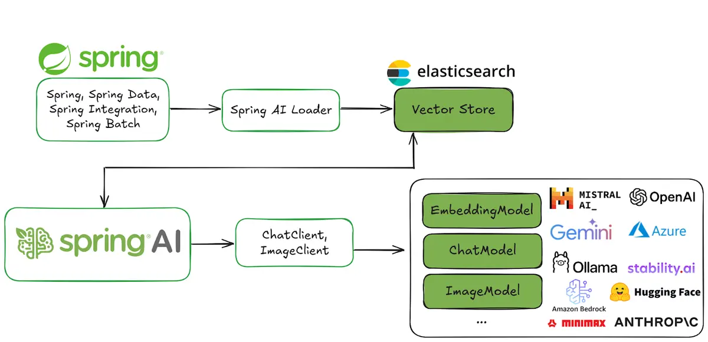

# Spring AI and Elasticsearch as your vector database

Full article [Spring AI and Elasticsearch as your vector database](https://www.elastic.co/search-labs/blog/spring-ai-elasticsearch-application).



## Dependencies

* JDK 21+
* Maven
* Elasticsearch, [start-local](https://www.elastic.co/docs/deploy-manage/deploy/self-managed/local-development-installation-quickstart) for a quickstart
* OpenAI API key

## Configuration

In *application.properties* configure — environment variables like `${OPENAI_API_KEY}` are recommended:

```properties
spring.ai.openai.api-key=${OPENAI_API_KEY}

spring.elasticsearch.uris=http://localhost:9200
spring.elasticsearch.username=elastic
spring.elasticsearch.password=${ELASTICSEARCH_PASSWORD}
```
